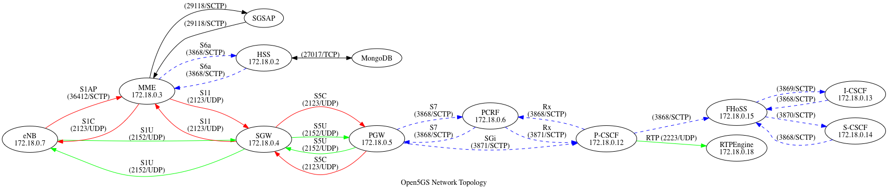

## Concept
The different scenarios / use cases are organized as so called *Stacks*. For each Stack there is
a corresponding directory in ``etc``. The Stack is described as a ``docker-compose.yaml`` file,
which configures all of the service dependencies (RAN, core network functions, databases, etc).
Because most services are used in multiple Stacks, the docker-compose file mainly just uses
references to the ``services.yaml`` files in the corresponding docker sub-project directory,
like for example:
```docker title="docker/mysql/services.yaml"
services:
    mysql:
        container_name: "mysql"
        image: o5gc/mysql
        env_file: ["${ENV_FILE}"]
        networks:
            corenet:
                ipv4_address: ${MYSQL_IP_ADDR}
```
```docker title="etc/srsran-open5gs-4g-volte/docker-compose.yaml"
services:
    mysql:
        extends:
            file: ${DOCKER}/mysql/services.yaml
            service: mysql
```
In addition to the ``docker-compose.yaml`` file, each Stack directory can contain Stack specific
configuration files, which are mounted explicitly for the corresponding service:
```docker title="etc/oairan-open5gs-5g/docker-compose.yaml"
    gnb:
        extends:
            file: ${DOCKER}/oai/services.yaml
            service: gnb
        image: o5gc/oai-ran:2023.w23-4.4.0.0
        volumes:
            - ./gnb.conf:/o5gc/openairinterface5g/etc/gnb.conf:ro
```
Furthermore, as described in the [Configuration section](user_guide.md#configuration), each
Stack directory can optionally include a ``settings.env`` file, which overrides the open5Gcube
global settings from ``etc`.

## OpenAirInterface
The [OpenAirInterface](https://openairinterface.org/) (OAI) based Stacks uses Docker images which
compiles the OAI source fetched from the official code repositories. No significant changes
compared to their installation manual was made.

#### OAI RAN
The Development of the [OAI RAN](https://gitlab.eurecom.fr/oai/openairinterface5g) is very
continuous. A new "version" is released every week (which are sometimes more, sometimes less
stable). Testing of new versions is possible by simply adjusting the Docker image version tag
in the docker-compose file of the relevant Stack (see example above). The UHD driver is also
compiled from the sources and the version can be easily changed as well. The Docker image tag
is composed of
``oai-ran:<year>.w<calendar week>-<UHD version>``,  e.g. ``oai-ran:2022.w32-3.15.0.0``.
Just run
```console
make docker-build-oai-ran
```
after changing the tag to build the Docker image for the specified version.

The Docker entrypoint shell script detects any connected USRP B210 (via lsusb) and prefers it.
Otherwise an USRP X310 must be reachable at the IP address ``192.168.40.2``.

#### OAI Core
The [OAI Core Network](https://gitlab.eurecom.fr/oai/cn5g/oai-cn5g-fed) is composed of separate
Docker images for each Network function. They are built from almost unchanged copies of the
original project Dockerfiles and uses their entrypoint scripts as well as the deployed project
configuration template files. Therefore, customization is only possible by setting certain
environment variables in the docker-compose file. Alternatively, the configuration file need to
be overwritten with a Stack specific version as described above.

The HSS / CN5G databases are initialized using short-lived ``init`` containers. They program
the settings (especially IMSI, Key, OPc) for all UEs configured in ``etc/uedb.env``.

#### 5G NSA
The OAI 4G Core Network uses the MME from the [Magma](https://github.com/magma/magma) project.
Call
```console
make run-oai-5g-nsa
```
to start the Core Network as well as the OAI eNB and gNB.

#### 5G SA
The OAI SA Core Network setup is supported in two - so called - "scenarios" by OAI:

* "Minimalist"
    * AMF, SMF, UPF (SPGWU), NRF, MySQL
    * SMF takes over the authentication
* "Basic"
    * AMF, SMF, UPF (SPGWU), NRF, MySQL, UDM, UDR, AUSF
    * Complete 5G CN specification

The initialization scripts / docker-compose files take care of the correct configuration.

Call
```console
make run-oai-5g-minimalist
```
respectively
```console
make run-oai-5g-basic
```
to start the Core Network as well as the OAI gNB.

## Open5GS
Open5GS implements a 4G as well as a 5G Core.

In contrast to the OAI Core, the Docker image for Open5GS contains the binaries for all services.
The installation inside the image follows the official guide for compiling the source code,
and the configuration files included in the Stack are almost unchanged from the examples.
Only the configuration of the SMF differs between 4G and 5G. The initialization script
programs the database via the Open5GS-WebUI with all configured UEs in ``etc/uedb``.

## VoLTE
The setup follows the
[VoLTE Setup with Kamailio IMS and Open5GS tutorial](https://open5gs.org/open5gs/docs/tutorial/02-VoLTE-setup/)
quite closely.
The network topology is comparable to the
[System Architecture Evolution (SAE)](https://en.wikipedia.org/wiki/System_Architecture_Evolution)
of LTE: 
The dockerized setup is inspired by the
[docker_open5gs github repository](https://github.com/herlesupreeth/docker_open5gs)
by Supreeth Herle.
srsRAN as well as OAI-RAN has been tested successfully to build a full Stack (both support for QoS
and dedicated radio bearer creation).
The initialization scripts configures all databases (especially the HSS of Open5Gs and the
additional FHoSS for VolTE) with the configured UEs in ``etc/uedb``. The MSISDN is programmed as
the last 5 digits of the IMSI.
To test VoLTE make sure the APN settings of the Ue are correct:

* Clear all previous APN settings
* Then, create APN as follows:
    * First create internet APN, APN name: internet, APN type: default –> Save APN
    * Then, create ims APN, APN name: ims, APN type: ims –> Save APN

Contrary to the tutorial, it does not seem necessary to disable the SQN check for Sysmocom SIM cards.

