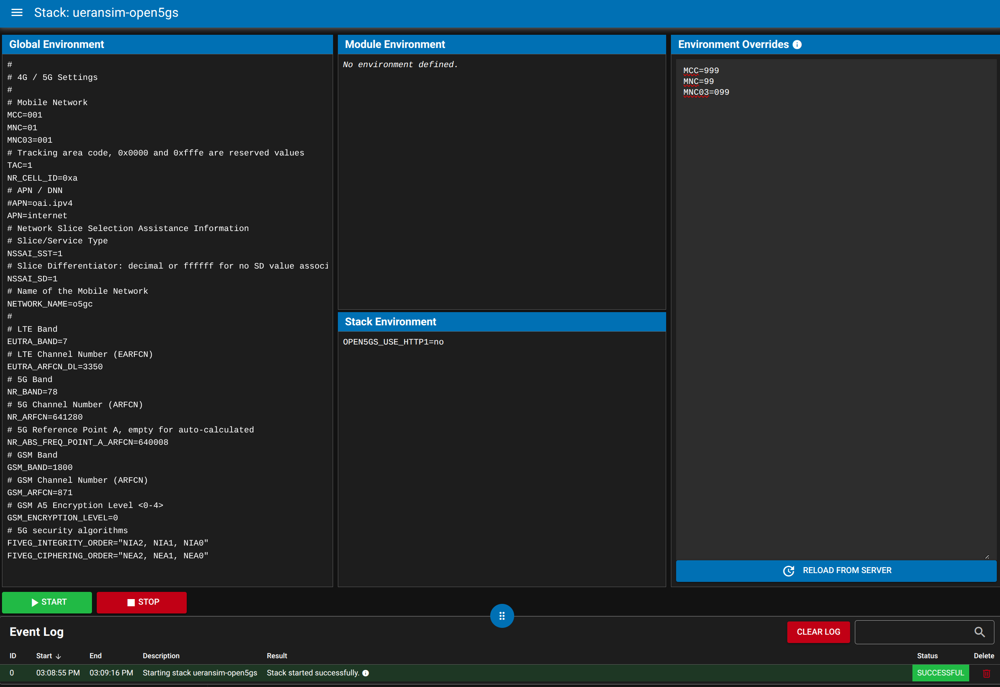
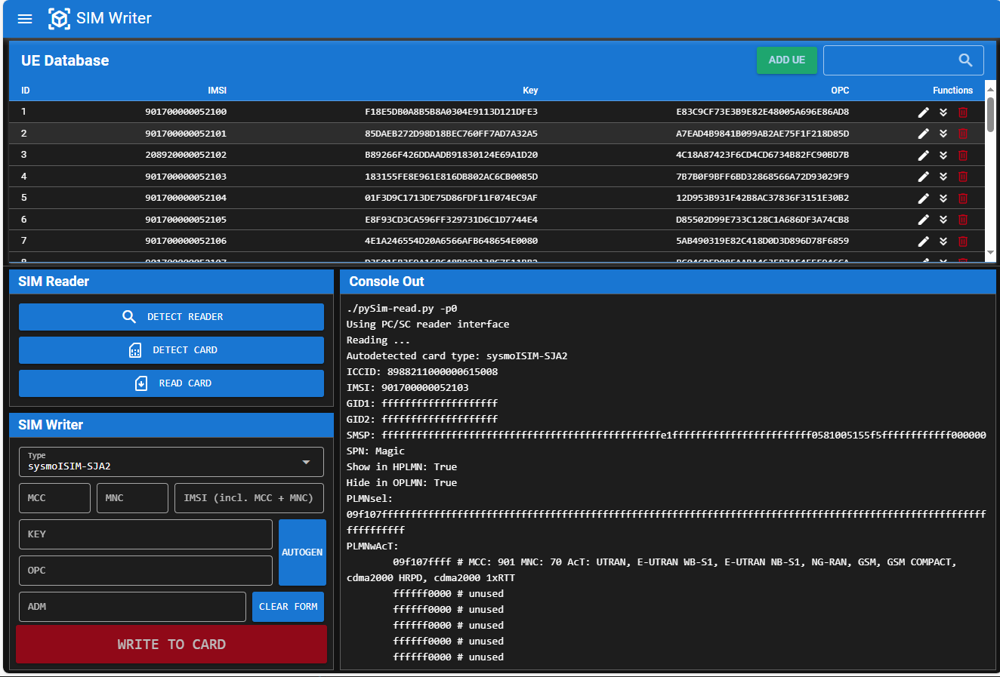

## Directory Structure
The main structure is as follows:

|                  |                                                                              |
| ---------------: | :--------------------------------------------------------------------------- |
| ``Makefile``     | Central entry point for all commands on the console                          |
| ``modules/base`` | Base module: Files for the base Docker image and services                    |
| ``modules/o5gc`` | Main module: Files for all the open-source projects integrated in open5Gcube |
| ``etc/``         | Central configuration files                                                  |
| ``scripts/``     | Boot-Startup as well as other helper scripts                                 |
| ``var/``         | Cache files to build the Docker images and run the Stacks                    |
| ``Doc/``         | This documentation                                                           |
| ``tests/``       | Automated (emulated) function tests - still under development                |

## Configuration
The configuration of the installation and the global settings across the Stacks is done via
different [environment files](https://docs.docker.com/compose/environment-variables/env-file/)
in the ``etc`` directory.

### ``local.env``
Sets system / installation specific settings, especially the network interface names as well as
the hostnames of the eNB and gNB RAN hosts
```shell title="etc/local.env"
# RF
CLOCK_SRC=external

# System Network Configuration
# CORENET_DRIVER should be
#   - 'macvlan' if components (such as the gNB) are distributed across different hosts
#   - 'bridge' if *all* components are running on this host
# run 'make systemd-startup-unit' after changing one of the following settings
CORENET_DRIVER=macvlan
# If macvlan is used, set the parent interface here
CORENET_MACVLAN_IFACE=eno1
# Interface name of the 10G adapter connected to the USRP X310 on the RAN hosts.
# Leave unchanged if USRP B210 via USB is used.
USRP_IFACE=enp3s0f0

# eNB / gNB RAN hostnames
ENB_HOSTNAME=o5gc2
GNB_HOSTNAME=o5gc3
```

### ``settings.env``
Sets especially the 4G / 5G mobile network settings like the PLMN, TAC, APN and the used
frequencies. These configurations are utilised by all Stacks if not
[configured explicitly](#stack-specific-settings) to different values in the Stack directory.

```shell title="etc/settings.env"
# Mobile Network
MCC=001
MNC=01
TAC=1
APN=internet
# Network Slice Selection Assistance Information
NSSAI_SST=1
NSSAI_SD=ffffff
# 5G Band
NR_BAND=78
# 5G Channel Number (ARFCN)
NR_ARFCN=641280
...
```

### ``uedb.env``
This file contains the *database* for all SIM Cards, including the IMSI, Key and the OPc.
On startup of the Core Networks short-living initialization containers and helper scripts uses
this settings to program the corresponding databases of the particular Core Network.

```shell title="etc/uedb.env"
UE_DB+="
#IMSI           Key                              OPc
# add one subscriper per line, like for example
001010000052100 F18E5DB0A8B5B8A0304E9113D121DFE3 E83C9CF73E3B9E82E48005A696E86AD8
...
"
```
In addition, each .env file in the optional directory ``etc/uedb.d/`` is included to extend the UE_DB. This can be used to organize the subscriber information in a separate repository.

### ``network.env``
The Docker network configuration does not usually need to be changed. The subnet masks and the
static IP addresses of the containers are configured in this file.

```shell title="etc/network.env"
# corenet
CORENET_SUBNET_ADDR=192.168.70.0
CORENET_SUBNET_SUFFIX=24
ENB_IP_ADDR=192.168.70.120
GNB_IP_ADDR=192.168.70.130
AMF_IP_ADDR=192.168.70.151
...
```

### Stack specific settings
Each Stack can override all of the above settings by providing a separate ``settings.env`` file in
its directory. This is useful if a Stack requires fix certain configurations to function correctly.

## Command Line Usage
A ``Makefile`` is the central entry point for all commands on the console, so they start all with
``make`` followed by the target which should be executed.
```console
make help
```
will list the most important targets. The console supports Tab-completion which helps exploring
the available commands as well.

### Build Docker Images
The build process is managed by the ``Makefile``, which takes care of handling the dependencies.
To build all images, the following command is executed:
```console
make docker-build-all
```
For building individual images, the Makefile provides the following command format:
```console
make docker-build-<image-name>
```
For example:
```console
make docker-build-oai-amf
```
To delete all images, the following command is used:
```console
make docker-purge-all-images
```

### Running Stacks
For each Stack defined in the modules, there is a ``make run-<stackname>`` command. So for
example, to run the 5G-SA Stack composed of OAI-RAN and Open5GS, run
```console
make run-oairan-open5gs-5g
```
This starts all containers of the Stack and attaches to their console output. To stop the Stack
just press ++ctrl+c++.

In general, for Mobile-Network Stacks the naming follows the convention ``<ran-project>-<core-project>-<technology>``.

The startup-scripts of the RAN containers automatically take over the execution of the
containers on the remote RAN hosts, if so configured in ``etc/local.env``.

As an alternative, it is possible to start each component separately. This is especially
useful if the RAN should run on the same host. Run
```console
make run-oairan-open5gs-5g-core
```
to start just the core of the Stack, and
```console
make run-oairan-open5gs-5g-gnb
```
to start the gnB.

{ align=right width=40% }
To get a better overview of the running containers on the Controller host,
[ctop](https://github.com/bcicen/ctop) provides a concise and condensed overview of
real-time metrics. It can be started with
```console
make ctop
```

### Flash Firmware of USRP X310
In contrast to the USRP B210, the firmware of the X310 is programmed persistent into its flash
memory. The firmware version is directly correlated the UHD driver version used by the RAN
containers and must therefore always match. A small script helps to simplify the programming of
the X310. Start it with
```console
make uhd_image_loader
```
and select the Stack and the RAN service (eNB or gNB) for which the X310 should be programmed.
The firmware will be then programmed from the corresponding container to the attached USRP.

## WebUI
{ align=right width=60% }

When booting the Controller host, the open5Gcube WebUI is started automatically, listening on
the standard HTTP port. The WebUI provides a user-friendly interface to

* get an overview of the currently running containers, including
    * the log output,
    * the health status
    * and detailed container information
* start and stop Stacks, optionally with adjusted settings
* read and write SIM Cards
* get links to web services by the Stack

### Service Overview
The Service Overview page shows all open5Gcube related Containers and their health / exit status.
The log outputs of the containers are continuously reloaded and updated. The number of log lines
that are kept per container can be configured in the settings.

Note, that the Service Overview page is Stack agnostic, meaning it doesn't know which container
belongs to which Stack and if all necessary containers are running.

#### Service Details
With a click on the title of a service, a detailed view of the container is shown. Especially
all low-level information of the container can be browsed in the *inspect* tab.

### Start / Stop a Stack
{ align=right width=50%}

With a click on one of the Stacks listed on the left menu, a page opens where the Stack can be
started and stopped. The [global](#settingsenv) and [Stack specific](#stack-specific-settings)
environment settings are shown for information. In addition, overrides can be entered in the
text box on the right. When starting the Stack, the running configuration is build from the
global settings, overwritten by the Stack specific settings, overwritten by the temporary
settings in the UI. The event log at the bottom shows the last performed actions.

After a stack has been started, the *Service Links* sub-menu on the left side is filled with
links to running web services that are provided by the Stack.

### Read / Write SIM Cards
{ align=right width=50%}

The WebUI can be used to read and write SIM Cards via a connected USB Card reader, using the
tools from the [pySim project](https://osmocom.org/projects/pysim/wiki).

In the table on the top the [configured UEs](#uedbenv) are shown. The *SIM Reader* below can be
used to read the content of a SIM card. The text output is shown in the console on the right.
The *SIM Writer* can be used to change the MMC, MNC and IMSI as well as the Key and OPc of a card.

!!! warning
    Make always sure to use the correct ADM1 for the specific card!
    Using a wrong ADM1 value several times consecutively, will likely permanently lock the card.
    For sysmoUSIM/ISIM products, three consecutive wrong ADM1 values will lock the ADM1.
