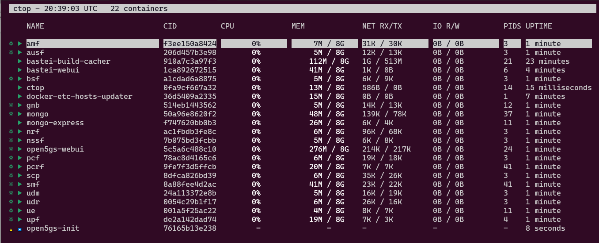
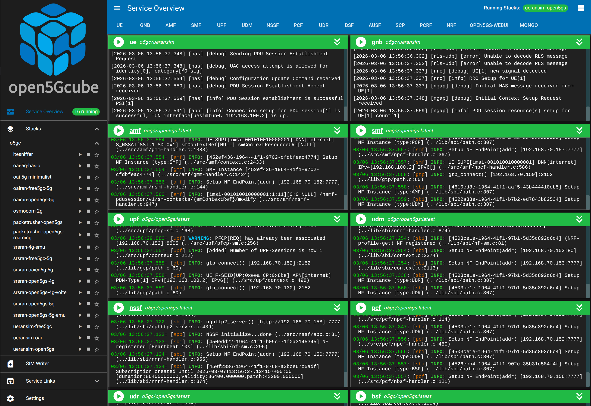

<div id="top">
  <p align="center">
    
  </p>
</div>

*open5Gcube* is a **Modular Framework for Mobile Network Laboratories**. It builds and manages **open-source mobile network stacks**, including 2G, 4G, and 5G systems. It is designed for research, testing, and educational purposes, providing users with a customizable and extensible environment for deploying radio access networks (RAN), core networks (CN), and supporting components.

---

I. [Overview](#-Overview) II. [Getting Started](#-Getting-Started) III. [Configuration](#%EF%B8%8F-configuration) IV. [Usage](#-Usage) V. [Documentation](#documentation) VI. [License](#-License)

---

## 📍 Overview

open5Gcube facilitates reproducible experiments across a variety of mobile network configurations by using:

- **Docker containers and Docker Compose** for isolated service deployments.
- **Pre-built network Stacks** representing different technology combinations (e.g., OAI-RAN + Open5GS core).
- **Remote container orchestration** across multiple physical hosts using SSH and Docker-outside-of-Docker (DooD).
- **A WebUI** for visual control and monitoring of the Stack deployments.
- **Support for physical SDR hardware** (USRP X310/B210), as well as emulated setups.

### Features

- Full-stack mobile network simulation (2G/4G/5G, NSA/SA)
- Integration with:
  - **Open5GS**, **OpenAirInterface**, **UERANSIM**, **srsRAN**, **osmocom**, and more
- Easy-to-use **WebUI**
  - View and control container health and logs
  - Start/stop Stacks
- **VoLTE** configuration based on Open5GS + Kamailio IMS
- SIM card provisioning tools via `pySim`

## 🚀 Getting Started

### Prerequisites
#### BIOS
For performance tuning, it is recommended to disable hyper-threading, CPU frequency control, C-States, P-States and any other power management settings.

#### Operating System
Ubuntu 22.04 is recommended as base host distribution.

### Installation 
#### Required Packages
```console
sudo apt install linux-tools-common net-tools make git-lfs ca-certificates curl gnupg openssh-server python3-virtualenv
```
#### Clone the Repository
```console
git clone https://github.com/open5Gcube/open5Gcube/
cd open5Gcube
```

#### Docker Engine
See [official Docker documentation](https://docs.docker.com/engine/install/ubuntu/#install-using-the-repository)
for details. Specific fixed versions of the Docker packages are installed with the script
``modules/base/docker/o5gc/install-docker.sh``. Execute it with
```console
make system-install-docker
```

### Install open5Gcube systemd Startup Service
```console
make systemd-install-unit
```

### Build all Docker Images
To build all docker images for all sub-projects on the Controller host as well as the ran projects on the configured ran hosts, run
```console
make build-cacher-start docker-build-all
```
and get yourself a big cup of coffee as this will take a few hours.

### Start the open5Gcube WebUI
```console
make webui-start
```

## ⚙️ Configuration
The configuration of the installation and the global settings across the Stacks is done via different [environment files](https://docs.docker.com/compose/environment-variables/env-file/) in the ``etc`` directory.

### System Specific Settings
The system installation specific configuration can be adjusted in the file ``etc/local.env``:

1. Set the ``CLOCK_SRC``either to ``external`` or ``internal``, depending on whether an external clock supply is connected to the USRP or not.
2. If components of the network (especially the RANs like the gNB) are distributed across different hosts, set the Docker network driver for the ``corenet`` to ``macvlan``. If all services are running on the same host, a ``bridge`` can be used instead.
```shell
# CORENET_DRIVER should be
#   - 'macvlan' if components (such as the gNB) are distributed across
#               different hosts
#   - 'bridge' if *all* components are running on this host
# run 'make systemd-startup-unit' after changing one of the following
# settings
CORENET_DRIVER=bridge
# If macvlan is used, set the parent interface here
CORENET_MACVLAN_IFACE=eno1
```
3. Set the ``USRP_IFACE`` to the interface name of the 10G adapter connected to the USRP X310 on the RAN hosts. Leave it unchanged if USRPs B210 via USB are used.
4. Configure the hostname of the enb and gnb ran hosts:
```shell
# eNB / gNB RAN hostnames
ENB_HOSTNAME=localhost
GNB_HOSTNAME=localhost
```

### ``settings.env``
Sets especially the 4G / 5G mobile network settings like the PLMN, TAC, APN and the used frequencies. These configurations are utilised by all Stacks if not [configured explicitly](#stack-specific-settings) to different values in the Stack directory.

```shell
# Mobile Network
MCC=001
MNC=01
TAC=1
APN=internet
# Network Slice Selection Assistance Information
NSSAI_SST=1
NSSAI_SD=ffffff
# 5G Band
NR_BAND=78
# 5G Channel Number (ARFCN)
NR_ARFCN=641280
...
```

### ``uedb.env``
This file contains the *database* for all SIM Cards, including the IMSI, Key and the OPc. On startup of the Core Networks short-living initialization containers and helper scripts uses this settings to program the corresponding databases of the particular Core Network.

```shell
#     IMSI            Key                              OPc
UE_1="901700000052100 F18E5DB0A8B5B8A0304E9113D121DFE3 E83C9CF73E3B9E82E48005A696E86AD8"
UE_2="901700000052101 85DAEB272D98D18BEC760FF7AD7A32A5 A7EAD4B9841B099AB2AE75F1F218D85D"
UE_3="208920000052102 B89266F426DDAADB91830124E69A1D20 4C18A87423F6CD4CD6734B82FC90BD7B"
...
```

### Stack specific settings
Each Stack can override all of the above settings by providing a separate ``settings.env`` file in its directory. This is useful if a Stack requires fix certain configurations to function correctly, for example if slicing is not supported.

## 🖵 Usage
### Command Line
A ``Makefile`` is the central entry point for all commands on the console, so they start all with ``make`` followed by the target which should be executed. ``make help`` will list the most important targets. Most consoles supports Tab-completion which helps exploring the available commands as well.

### Build Docker Images
The build process is managed by the ``Makefile``, which takes care of handling the dependencies.
To build all images, the following command is executed:
```console
make docker-build-all
```
For building individual images, the Makefile provides the following command format:
```console
make docker-build-<image-name>
```
For example:
```console
make docker-build-oai-amf
```
To delete all images, the following command is used:
```console
make docker-purge-all-images
```

### Running Stacks
For each Stack defined in the modules, there is a ``make run-<stackname>`` command. So for example, to run the 5G-SA Stack composed of OAI-RAN and Open5GS, run
```console
make run-oairan-open5gs-5g
```
This starts all containers of the Stack and attaches to their console output. To stop the Stack just press <kbd>Ctrl</kbd> + <kbd>c</kbd>.

In general, for Mobile-Network Stacks the naming follows the convention ``<ran-project>-<core-project>-<technology>``.

The startup-scripts of the RAN containers automatically take over the execution of the containers on the remote RAN hosts, if so configured in ``etc/local.env``.

As an alternative, it is possible to start each component separately. This is especially useful if the RAN should run on the same host. Run
```console
make run-oairan-open5gs-5g-core
```
to start just the core of the Stack, and
```console
make run-oairan-open5gs-5g-gnb
```
to start the gnB.



To get a better overview of the running containers on the Controller host, [ctop](https://github.com/bcicen/ctop) provides a concise and condensed overview of real-time metrics. It can be started with

```console
make ctop
```

### WebUI


When booting the Controller host, the open5Gcube WebUI is started automatically, listening on the standard HTTP port. The WebUI provides a user-friendly interface to
* Get an overview of the currently running containers, including
    * the log output,
    * the health status
    * and detailed container information
* Start and stop Stacks, optionally with adjusted settings
* Read and write SIM Cards
* Get links to web services by the Stack


## 📄	Documentation

Comprehensive documentation can be found in the [Doc](/Doc) directory as well as in the WebUI.

## 📜 License

This project is licensed under the terms of the Apache-2.0 license. For more details, refer to the [LICENSE](LICENSE) file.
